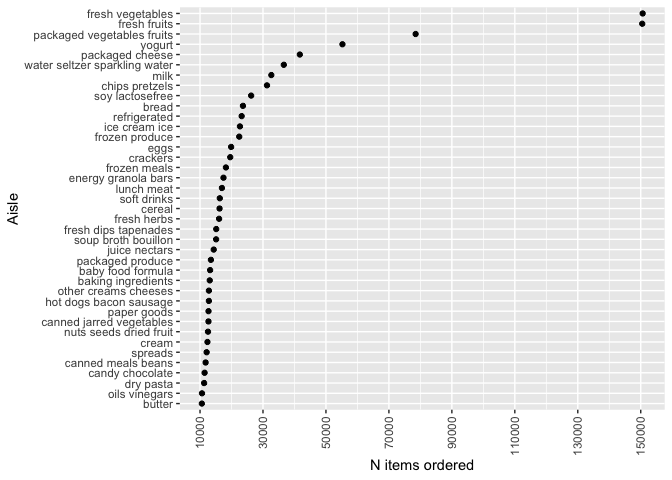

p8105_hw2_SC4934
================

# library

``` r
library(tidyverse)
```

    ## ── Attaching packages ─────────────────────────────────────── tidyverse 1.3.2 ──
    ## ✔ ggplot2 3.3.6      ✔ purrr   0.3.4 
    ## ✔ tibble  3.1.8      ✔ dplyr   1.0.10
    ## ✔ tidyr   1.2.0      ✔ stringr 1.4.0 
    ## ✔ readr   2.1.2      ✔ forcats 0.5.1 
    ## ── Conflicts ────────────────────────────────────────── tidyverse_conflicts() ──
    ## ✖ dplyr::filter() masks stats::filter()
    ## ✖ dplyr::lag()    masks stats::lag()

``` r
library(ggplot2)
library(gtsummary)
```

## Problem 1

``` r
devtools::install_github("p8105/p8105.datasets")
```

    ## Skipping install of 'p8105.datasets' from a github remote, the SHA1 (412759e3) has not changed since last install.
    ##   Use `force = TRUE` to force installation

``` r
library(p8105.datasets)
data("instacart")
```

# Dataset description

``` r
skimr::skim(instacart)
```

in the `instacart` dataset, there are 1384617 observations of 15
variables. of those 4 are character type and 11 are numeric. some of the
key variables include `order_id` which is the order
identifier,`product_id`, which is the product identifier, and `user_id`,
which is the user identifier.

and giving illstrative examples of observations. Then, do or answer the
following (commenting on the results of each):

# how many aisles:

``` r
instacart %>%
  select(aisle) %>%
  distinct
```

    ## # A tibble: 134 × 1
    ##    aisle                        
    ##    <chr>                        
    ##  1 yogurt                       
    ##  2 other creams cheeses         
    ##  3 fresh vegetables             
    ##  4 canned meat seafood          
    ##  5 fresh fruits                 
    ##  6 packaged cheese              
    ##  7 specialty cheeses            
    ##  8 water seltzer sparkling water
    ##  9 cream                        
    ## 10 packaged vegetables fruits   
    ## # … with 124 more rows
    ## # ℹ Use `print(n = ...)` to see more rows

``` r
instacart %>%
  group_by(aisle) %>%
  summarize(orders = n()) %>% 
  arrange(desc(orders))
```

    ## # A tibble: 134 × 2
    ##    aisle                         orders
    ##    <chr>                          <int>
    ##  1 fresh vegetables              150609
    ##  2 fresh fruits                  150473
    ##  3 packaged vegetables fruits     78493
    ##  4 yogurt                         55240
    ##  5 packaged cheese                41699
    ##  6 water seltzer sparkling water  36617
    ##  7 milk                           32644
    ##  8 chips pretzels                 31269
    ##  9 soy lactosefree                26240
    ## 10 bread                          23635
    ## # … with 124 more rows
    ## # ℹ Use `print(n = ...)` to see more rows

there are 134 aisles. The most orders are from the fresh vegetables
aisle (`aisle_id` = 83), with 150609 orders.

## plot

``` r
instacart %>%
  group_by(aisle) %>%
  summarize(orders = n()) %>% 
  arrange(desc(orders)) %>%
  filter(orders > 10000) %>% 
  mutate(aisle = fct_reorder(aisle, orders)) %>% 
  ggplot(aes(x = orders, y = aisle)) +
  geom_point() +
  labs(
    x = "N items ordered",
    y = "Aisle",
  ) + 
  scale_x_continuous(
    breaks = c(10000, 30000, 50000, 70000, 90000, 110000, 130000, 150000),
    labels = c("10000", "30000", "50000", "70000", "90000", "110000", "130000", "150000")
  ) +
  theme(axis.text.x = element_text(angle = 90, vjust = 0.5, hjust=1))
```

<!-- -->

Make a table showing the three most popular items in each of the aisles
“baking ingredients”, “dog food care”, and “packaged vegetables fruits”.
Include the number of times each item is ordered in your table.

## table

``` r
popular_items = 
  instacart %>%
  group_by(aisle, product_name) %>% 
  distinct() %>% 
  summarize(orders = n()) %>% 
  ungroup() %>% 
  group_by(aisle) %>% 
  mutate(rank = min_rank(desc(orders))) %>% 
  filter(rank < 4) %>% 
  filter(aisle == "packaged vegetables fruits"|aisle == "dog food care" | aisle == "baking ingredients") %>%
  arrange(orders) %>% 
  pivot_wider(
    names_from = aisle,
    values_from = orders,
  ) %>% 
  select(-rank)
```

    ## `summarise()` has grouped output by 'aisle'. You can override using the
    ## `.groups` argument.

``` r
popular_items
```

    ## # A tibble: 9 × 4
    ##   product_name                                  `dog food care` baking…¹ packa…²
    ##   <chr>                                                   <int>    <int>   <int>
    ## 1 Small Dog Biscuits                                         26       NA      NA
    ## 2 Organix Chicken & Brown Rice Recipe                        28       NA      NA
    ## 3 Snack Sticks Chicken & Rice Recipe Dog Treats              30       NA      NA
    ## 4 Cane Sugar                                                 NA      336      NA
    ## 5 Pure Baking Soda                                           NA      387      NA
    ## 6 Light Brown Sugar                                          NA      499      NA
    ## 7 Organic Blueberries                                        NA       NA    4966
    ## 8 Organic Raspberries                                        NA       NA    5546
    ## 9 Organic Baby Spinach                                       NA       NA    9784
    ## # … with abbreviated variable names ¹​`baking ingredients`,
    ## #   ²​`packaged vegetables fruits`

## table 2

``` r
time = 
  instacart %>% 
  group_by(product_name, order_hour_of_day, order_dow) %>% 
  summarize(
    mean_hour = mean(order_hour_of_day, na.rm = TRUE)
  ) %>% 
  filter(product_name == "Pink Lady Apples" | product_name == "Coffee Ice Cream") %>% 
  ungroup() %>% 
    pivot_wider(
      names_from = product_name,
      values_from = mean_hour
    )
  

time = 
  instacart %>% 
  select(product_name, order_hour_of_day, order_dow) %>% 
  filter(product_name == "Pink Lady Apples" | product_name == "Coffee Ice Cream") %>% 
  pivot_wider(
    names_from = order_dow,
    values_from = order_hour_of_day
    
  )
```

    Make a table showing the mean hour of the day at which Pink Lady Apples and Coffee Ice Cream are ordered on each day of the week; format this table for human readers (i.e. produce a 2 x 7 table).

# Problem 2

## load and tidy

``` r
accel_data = 
  read_csv(
  "data/accel_data.csv") %>% 
  janitor::clean_names() %>% 
  mutate(
    weekend_vs_weekday = case_when(day == "Saturday"| day == "Sunday" ~ "Weekend", 
    day == "Monday"| day == "Tuesday" | day == "Wednesday" | day =="Thursday" | day == "Friday" ~ "Weekday")
  )
```

    ## Rows: 35 Columns: 1443
    ## ── Column specification ────────────────────────────────────────────────────────
    ## Delimiter: ","
    ## chr    (1): day
    ## dbl (1442): week, day_id, activity.1, activity.2, activity.3, activity.4, ac...
    ## 
    ## ℹ Use `spec()` to retrieve the full column specification for this data.
    ## ℹ Specify the column types or set `show_col_types = FALSE` to quiet this message.
