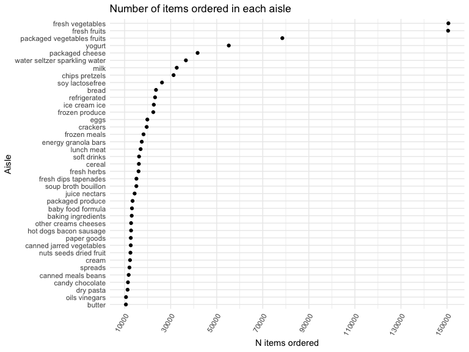
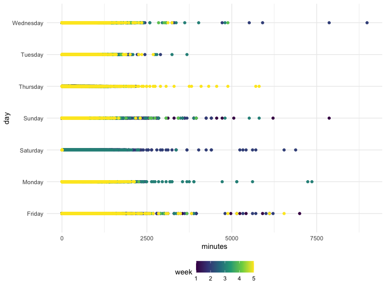

p8105_hw2_SC4934
================

# library

## Problem 1

``` r
data("instacart")

instacart = 
  instacart %>% 
  as_tibble(instacart)
```

# Dataset description

``` r
skimr::skim(instacart)
```

In the instacart dataset, there are 1384617 rows and 15 columns, with
each row resprenting a single product from an instacart order. Variables
include identifiers for user, order, and product; the order in which
each product was added to the cart. There are several order-level
variables, describing the day and time of the order, and number of days
since prior order. Then there are several item-specific variables,
describing the product name (e.g. Yogurt, Avocado), department
(e.g. dairy and eggs, produce), and aisle (e.g. yogurt, fresh fruits),
and whether the item has been ordered by this user in the past. In
total, there are 39123 products found in 131209 orders from 131209
distinct users

# how many aisles:

``` r
instacart %>% 
  count(aisle) %>% 
  arrange(desc(n))
```

    ## # A tibble: 134 × 2
    ##    aisle                              n
    ##    <chr>                          <int>
    ##  1 fresh vegetables              150609
    ##  2 fresh fruits                  150473
    ##  3 packaged vegetables fruits     78493
    ##  4 yogurt                         55240
    ##  5 packaged cheese                41699
    ##  6 water seltzer sparkling water  36617
    ##  7 milk                           32644
    ##  8 chips pretzels                 31269
    ##  9 soy lactosefree                26240
    ## 10 bread                          23635
    ## # … with 124 more rows
    ## # ℹ Use `print(n = ...)` to see more rows

there are 134 aisles. The most orders are from the fresh vegetables
aisle (`aisle_id` = 83), with 150609 orders.

## plot

``` r
instacart %>%
  group_by(aisle) %>%
  summarize(orders = n()) %>% 
  arrange(desc(orders)) %>%
  filter(orders > 10000) %>% 
  mutate(aisle = fct_reorder(aisle, orders)) %>% 
  ggplot(aes(x = orders, y = aisle)) +
  geom_point() +
  labs(
    x = "N items ordered",
    y = "Aisle",
    title = "Number of items ordered in each aisle"
  ) + 
  scale_x_continuous(
    breaks = c(10000, 30000, 50000, 70000, 90000, 110000, 130000, 150000),
    labels = c("10000", "30000", "50000", "70000", "90000", "110000", "130000", "150000")
  ) +
  theme(axis.text.x = element_text(angle = 60, hjust = 1))
```



## table

this table shows the three most popular items in aisles
`baking ingredients`, `dog food care`, and `packaged vegetables fruits`,
and the amount of times each item was ordered.

``` r
instacart %>% 
  filter(aisle %in% c("baking ingredients", "dog food care", "packaged vegetables fruits")) %>%
  group_by(aisle) %>% 
  count(product_name) %>% 
  mutate(rank = min_rank(desc(n))) %>% 
  filter(rank < 4) %>% 
  arrange(desc(n)) %>%
  knitr::kable()
```

| aisle                      | product_name                                  |    n | rank |
|:---------------------------|:----------------------------------------------|-----:|-----:|
| packaged vegetables fruits | Organic Baby Spinach                          | 9784 |    1 |
| packaged vegetables fruits | Organic Raspberries                           | 5546 |    2 |
| packaged vegetables fruits | Organic Blueberries                           | 4966 |    3 |
| baking ingredients         | Light Brown Sugar                             |  499 |    1 |
| baking ingredients         | Pure Baking Soda                              |  387 |    2 |
| baking ingredients         | Cane Sugar                                    |  336 |    3 |
| dog food care              | Snack Sticks Chicken & Rice Recipe Dog Treats |   30 |    1 |
| dog food care              | Organix Chicken & Brown Rice Recipe           |   28 |    2 |
| dog food care              | Small Dog Biscuits                            |   26 |    3 |

## table 2

this table shows

``` r
instacart %>%
  filter(product_name %in% c("Pink Lady Apples", "Coffee Ice Cream")) %>%
  group_by(product_name, order_dow) %>%
  summarize(mean_hour = mean(order_hour_of_day)) %>%
  spread(key = order_dow, value = mean_hour) %>%
  knitr::kable(digits = 2)
```

| product_name     |     0 |     1 |     2 |     3 |     4 |     5 |     6 |
|:-----------------|------:|------:|------:|------:|------:|------:|------:|
| Coffee Ice Cream | 13.77 | 14.32 | 15.38 | 15.32 | 15.22 | 12.26 | 13.83 |
| Pink Lady Apples | 13.44 | 11.36 | 11.70 | 14.25 | 11.55 | 12.78 | 11.94 |

this table shows the mean hour of day at whidh pink apples and coffee
ice cream are ordered on each day of the week. the table was formatted
in an untidy way so it is easier for humans to read. pink lady apples
are mostly ordered earlier in the day than Coffee Ice Cream.

# Problem 2

## load and tidy

``` r
accel_data = 
  read_csv(
  "data/accel_data.csv") %>% 
  janitor::clean_names() %>% 
  pivot_longer(
    activity_1:activity_1440,
    names_to = "activity",
    values_to = "minutes",
    names_prefix = 'activity_'
  ) %>% 
  mutate(
    weekend_vs_weekday = case_when(day == "Saturday"| day == "Sunday" ~ "Weekend", 
    day == "Monday"| day == "Tuesday" | day == "Wednesday" | day =="Thursday" | day == "Friday" ~ "Weekday")
  )
```

    ## Rows: 35 Columns: 1443
    ## ── Column specification ────────────────────────────────────────────────────────
    ## Delimiter: ","
    ## chr    (1): day
    ## dbl (1442): week, day_id, activity.1, activity.2, activity.3, activity.4, ac...
    ## 
    ## ℹ Use `spec()` to retrieve the full column specification for this data.
    ## ℹ Specify the column types or set `show_col_types = FALSE` to quiet this message.

the datasets includes 50400 rows and 6 columns. the character variable
`weekend_vs_weekday` was created. in total, there are 35 days tracked in
the dataset.

describe more

## Aggregate table

``` r
accel_data %>% 
  group_by(week, day) %>% 
  summarize(total = sum(minutes)) %>% 
  pivot_wider(
    names_from = day,
    values_from = total,
  ) %>% 
  select(week, Monday, Tuesday, Wednesday, Thursday, Friday, Saturday, Sunday) %>% 
  knitr::kable(digits=2) 
```

    ## `summarise()` has grouped output by 'week'. You can override using the
    ## `.groups` argument.

| week |    Monday |  Tuesday | Wednesday | Thursday |   Friday | Saturday | Sunday |
|-----:|----------:|---------:|----------:|---------:|---------:|---------:|-------:|
|    1 |  78828.07 | 307094.2 |    340115 | 355923.6 | 480542.6 |   376254 | 631105 |
|    2 | 295431.00 | 423245.0 |    440962 | 474048.0 | 568839.0 |   607175 | 422018 |
|    3 | 685910.00 | 381507.0 |    468869 | 371230.0 | 467420.0 |   382928 | 467052 |
|    4 | 409450.00 | 319568.0 |    434460 | 340291.0 | 154049.0 |     1440 | 260617 |
|    5 | 389080.00 | 367824.0 |    445366 | 549658.0 | 620860.0 |     1440 | 138421 |

some of the trends show decreased activity during the weekend compared
to the weekdays. For example, activity 4 and 5 are generally lower in
the weekend than the weekdays. activity 1 starts off lower on Monday and
increases steadily during the week.

more trends?

## plot

``` r
accel_data %>% 
  group_by(week, day) %>% 
  ggplot(aes(x = minutes, y = day, color = week )) +
  geom_point()
```



plot needs more work

# Problem 3

## load data

``` r
data("ny_noaa")

ny_noaa = 
  ny_noaa %>% 
  as_tibble(ny_noaa) %>% 
    janitor::clean_names() 


skimr::skim(ny_noaa)
```

|                                                  |         |
|:-------------------------------------------------|:--------|
| Name                                             | ny_noaa |
| Number of rows                                   | 2595176 |
| Number of columns                                | 7       |
| \_\_\_\_\_\_\_\_\_\_\_\_\_\_\_\_\_\_\_\_\_\_\_   |         |
| Column type frequency:                           |         |
| character                                        | 3       |
| Date                                             | 1       |
| numeric                                          | 3       |
| \_\_\_\_\_\_\_\_\_\_\_\_\_\_\_\_\_\_\_\_\_\_\_\_ |         |
| Group variables                                  | None    |

Data summary

**Variable type: character**

| skim_variable | n_missing | complete_rate | min | max | empty | n_unique | whitespace |
|:--------------|----------:|--------------:|----:|----:|------:|---------:|-----------:|
| id            |         0 |          1.00 |  11 |  11 |     0 |      747 |          0 |
| tmax          |   1134358 |          0.56 |   1 |   4 |     0 |      532 |          0 |
| tmin          |   1134420 |          0.56 |   1 |   4 |     0 |      548 |          0 |

**Variable type: Date**

| skim_variable | n_missing | complete_rate | min        | max        | median     | n_unique |
|:--------------|----------:|--------------:|:-----------|:-----------|:-----------|---------:|
| date          |         0 |             1 | 1981-01-01 | 2010-12-31 | 1997-01-21 |    10957 |

**Variable type: numeric**

| skim_variable | n_missing | complete_rate |  mean |     sd |  p0 | p25 | p50 | p75 |  p100 | hist  |
|:--------------|----------:|--------------:|------:|-------:|----:|----:|----:|----:|------:|:------|
| prcp          |    145838 |          0.94 | 29.82 |  78.18 |   0 |   0 |   0 |  23 | 22860 | ▇▁▁▁▁ |
| snow          |    381221 |          0.85 |  4.99 |  27.22 | -13 |   0 |   0 |   0 | 10160 | ▇▁▁▁▁ |
| snwd          |    591786 |          0.77 | 37.31 | 113.54 |   0 |   0 |   0 |   0 |  9195 | ▇▁▁▁▁ |

the dataset `ny_noaa` contains 2595176 rows and 7 columns. there are 3
character, 1 date, and 3 numeric variables. the variables include id,
which is the weather station ID, date - date of observation,
precipitation and snowfall information in `prcp`,`snow` and `snwd`, and
maximum and minimum temperatures in `tmax` and `tmin`. there are 747
weather stations tracked in the dataset. There is a significant amount
of missing data, especially in `tmin` and `tmax`.

## cleaning

``` r
ny_noaa = ny_noaa %>% 
  separate(date, into = c("year", "month", "day"), sep = "-", convert = TRUE) 
  
ny_noaa = ny_noaa %>% 
  mutate(
    prcp = as.integer(prcp),
    tmax = as.integer(tmax),
    tmin = as.integer(tmin),
    prcp = prcp/10,
    tmax = tmax/10,
    tmin = tmin/10
  )
```

39123

For snowfall, what are the most commonly observed values? Why?
